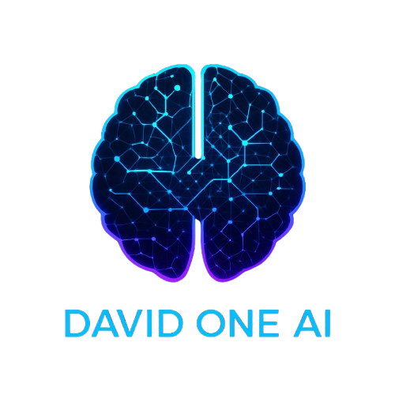

<p align="center">
  
</p>

# 🤖 David One AI – Offline Full‑Stack Multilingual AI

**Author:** David  
**Email:** davidk76011@gmail.com  
**Runs via:** `main.aya` (using the [Arya Framework](https://github.com/david0154/Arya))  
**License:** MIT  

---

## 🧠 What Is David One AI?

**David One AI** is a full offline intelligent assistant that can:

- 💬 Chat in your language (voice or text)
- 💻 Generate code (HTML, Python, JS, etc.)
- 🖼️ Edit, enhance, and deblur images
- 🗣️ Speak in **9+ languages**
- 🔌 Run without internet after setup

---

## 🖥️ System Requirements

> Minimum specs to run David One AI smoothly:

| Component     | Recommended                       |
|---------------|-----------------------------------|
| 💽 RAM        | 8 GB (minimum), 16 GB preferred    |
| 🧠 CPU        | 4-core+ processor (Intel i5/Ryzen 5 or higher) |
| 🎮 GPU        | 4 GB VRAM (NVIDIA/AMD) optional (CPU fallback enabled) |
| 💾 Storage    | ~8 GB (initial setup & models)     |
| 🖥️ OS         | Windows, Linux, or macOS           |
| 🌐 Internet   | Required once (to download models) |

> ✅ After first run, the AI runs **fully offline.**

---

## 🌍 Multilingual Voice Support

David One AI supports both text and voice in:

> 🇬🇧 English • 🇮🇳 Hindi • 🇧🇩 Bengali • 🇱🇰 Tamil • 🇮🇳 Marathi • 🇮🇳 Punjabi • 🇵🇰 Urdu • 🇮🇳 Telugu • 🇮🇳 Assamese

---

## ⚙️ How to Install Arya Framework

David One AI uses the [Arya Framework](https://github.com/david0154/Arya) to launch `.aya` files.

### 🧩 Install Steps

```bash
# 1. Clone Arya Framework
git clone https://github.com/david0154/Arya.git
```
```bash
cd Arya
```

# 2. Install Arya dependencies
```bash
pip install -r requirements.txt
```

# 3. Install Arya globally
```bash
python setup.py install
```
2. Ensure `.aya` files run correctly:
   ```bash
   arya run main.aya
   ```
3. Back in the `David-one-ai/` directory, simply run:
   ```bash
   python main.aya
   ```


## 🌍 Language Support

Understands & speaks:

🇬🇧 English • 🇮🇳 Hindi • 🇧🇩 Bengali • 🇱🇰 Tamil • 🇮🇳 Marathi • 🇮🇳 Punjabi • 🇵🇰 Urdu • 🇮🇳 Telugu • 🇮🇳 Assamese

---

## 📦 Key Features

| Type        | Description                                                                 |
|-------------|-----------------------------------------------------------------------------|
| 💬 Chat     | Multilingual chat with intelligent replies                                  |
| 💻 Coding   | Generate code or debug scripts in many languages                            |
| 🖼️ Edit     | Background removal, masking using SegFormer                                 |
| ✨ Enhance  | Upscale and clarify images with Real‑ESRGAN                                  |
| 🔍 Deblur   | Remove motion blur using DeblurGANv2                                        |
| 🗣️ Voice    | Real-time STT + TTS via Whisper & Coqui XTTS                                |
| 🧠 Offline  | Fully self-contained, no internet needed post-download                      |

---

## 📁 Project Structure

```
David‑one‑ai/
│
├── main.aya                 # Launcher script via Arya
├── requirements.txt         # All Python dependencies
├── logo.png                 # David One AI logo image
├── README.md
└── modules/
    ├── setup.py             # Downloads all models (chat, voice, image)
    ├── brain.py             # Core intelligence engine
    ├── ui.py                # Gradio-based UI
    ├── voice.py             # STT & TTS logic
    ├── image_edit.py        # Image background removal/masking
    ├── image_enhance.py     # Real‑ESRGAN upscaling
    ├── image_deblur.py      # DeblurGANv2 module
    ├── deblurgan.py         # DeblurGANv2 neural network code
    └── translator.py        # Multilingual detect/translate functions
```

---

## 🛠️ How to Run

1. Download and unzip the complete package (including `logo.png`).
2. Install dependencies:
   ```bash
   pip install -r requirements.txt
   ```
3. Ensure Arya framework is installed and `arya` is available:
   ```bash
   arya --help
   ```
4. Launch the AI:
   ```bash
   python main.aya
   ```

On first run, the system downloads all pretrained models:

- Chat (Deepseek‑Coder)
- STT (Whisper)
- TTS (Coqui XTTS)
- Image tools: SegFormer, Real‑ESRGAN, DeblurGANv2

---

## 📜 License

Released under the **MIT License**. Feel free to modify and distribute!

---

## 📧 Contact

Questions, feedback, or support? Reach out to:

> **David** – davidk76011@gmail.com
